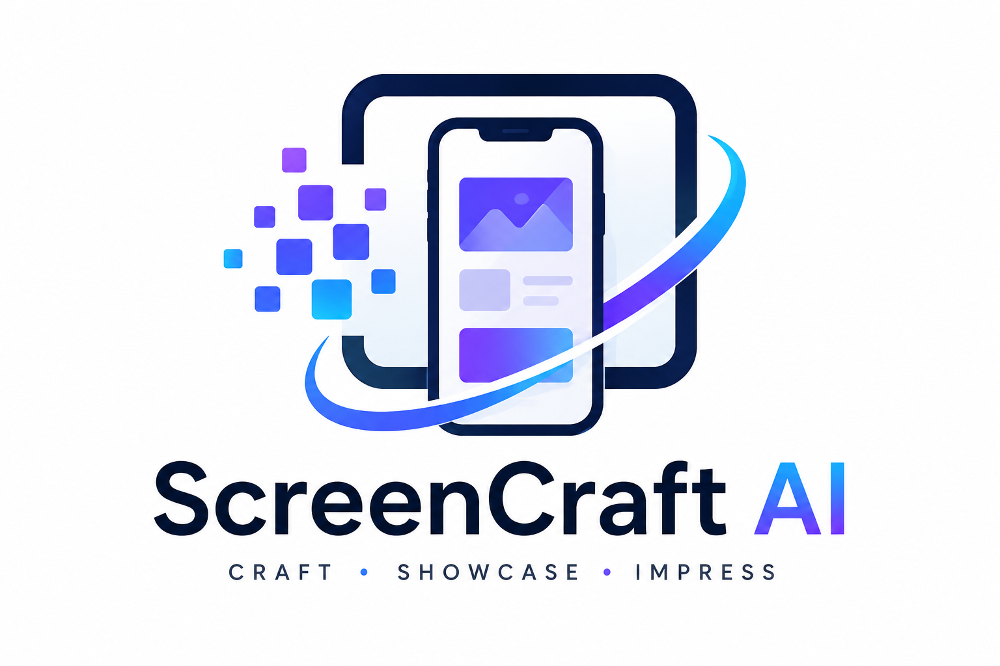

<div align="center">
  
  <h1>ScreenCraft AI 🚀</h1>
  <p><b>Turn Flutter & Mobile App UI Screenshots into High-Converting Web Showcases</b></p>

  [](https://github.com)
  [](https://flutter.dev)
  [](https://ai.google.dev)
  [](https://www.typescriptlang.org/)
</div>

---

## 🌟 About The Project

**ScreenCraft AI** was created as a passion project to solve a common challenge faced by **Flutter & Mobile App Developers**: presenting mobile UI screens and app features in a professional, interactive web showcase.

Built entirely using **Vibe Coding** (AI-assisted agentic software development), ScreenCraft AI empowers developers to upload raw Flutter app screenshots and instantly generate:
- 📱 **Interactive Device Frame Mockups** (iPhone 16 Pro, Google Pixel 9, Samsung S25, Minimal Flat chassis).
- ✍️ **AI-Generated Copywriting** (Hero headlines, feature highlights, and architecture insights generated via Gemini 2.5 AI).
- 🛠️ **Front Camera Cutout Customization** (Wide Dynamic Island, Small Island, Round Corner, Round Center).
- 📦 **One-Click Export** (Self-contained HTML showcase landing pages, GitHub README Markdown, and Project JSON).

---

## ✨ Key Features

- **📱 Dynamic Device Customizer**:
  - Customize phone chassis finish (Titanium, Space Black, Silver, Deep Purple, Desert Gold).
  - Select front camera style (Wide Island, Small Island, Round on Corner, Round in Center).
  - Glass glare overlay and realistic elevation drop shadows.
- **⚡ AI Screen Vision & Copy Generation**:
  - Automatically analyze uploaded UI screenshots using Gemini AI to detect UI components.
  - One-click copy generator for high-converting marketing hero section and tech architecture overview.
- **🎨 Interactive Key Capabilities Manager**:
  - Add, edit, and delete technical feature cards with custom Lucide icon pickers.
- **💾 Local Draft Isolation & Persistent Storage**:
  - Operates safely on local draft state with explicit "Save Project" persistence to `localStorage`.
- **📤 Production Ready Exports**:
  - Download self-contained standalone HTML landing pages.
  - Export formatted Markdown documentation for GitHub READMEs.

---

## 🛠️ Tech Stack & Architecture

- **Frontend**: React 18, TypeScript, Tailwind CSS, Lucide Icons, Canvas Confetti
- **Backend / AI Proxy**: Node.js, Express, `@google/genai` (Gemini 2.5 / Flash API)
- **Build System**: Vite 6, TSX test runner
- **Development**: Built via **Vibe Coding** with Google Antigravity AI Assistant

---

## 🚀 Quick Start Guide

### Prerequisites
- [Node.js](https://nodejs.org/) (v18 or higher)
- npm or yarn

### Installation & Setup

1. **Clone the repository**:
   ```bash
   git clone https://github.com/YOUR_USERNAME/screencraft-ai.git
   cd screencraft-ai
   ```

2. **Install dependencies**:
   ```bash
   npm install
   ```

3. **Configure Environment Variables**:
   Create a `.env` file in the root directory:
   ```env
   GEMINI_API_KEY=your_gemini_api_key_here
   PORT=3000
   ```

4. **Run the application**:
   ```bash
   npm run dev
   ```
   Open [http://localhost:3000](http://localhost:3000) in your browser.

---

## 🧪 Unit Testing

ScreenCraft AI includes automated unit tests covering storage CRUD, draft isolation, and export generators:

```bash
cmd /c npx tsx src/services/__tests__/storageService.test.ts
```

---

## 💙 Vibe Coding Philosophy

> *"Building software at the speed of thought."*

This project stands as a showcase of modern **Vibe Coding**—leveraging advanced AI coding agents to rapidly architect, design, debug, test, and polish full-stack web applications without compromising code quality or design aesthetics.

---

## 📜 License

Distributed under the MIT License. See `LICENSE` for more information.
